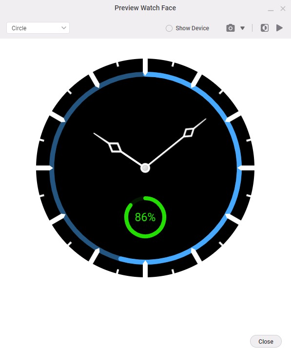
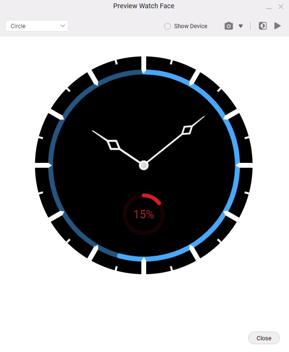

# Wear OS Watch Face

## Features

### 1. **Hour and Minute Ticks**
- Precise hour and minute ticks for easy readability and a clean aesthetic.

### 2. **Dynamic Battery Indicator**
- Displays the battery status with a color-coded indicator:
  - **Green**: When the battery level is above 20%.
  - **Red**: When the battery level falls below and equal 20%, signaling low power.

## Description
This custom Wear OS watch face combines functionality with style. The clear hour and minute ticks ensure a straightforward reading experience, while the dynamic battery indicator adds a practical touch, alerting users visually when the battery is running low.

The watch face is designed to be:
- **User-friendly**: Intuitive and easy to understand.
- **Power Saver**: Optimized to consume minimal battery, ensuring prolonged device usage.
- **Functional**: Real-time battery monitoring with clear visual cues.

## Screenshots

### 1. Watch Face with Battery Above 20%

### 2. Watch Face with Battery Below and Equal to 20%

